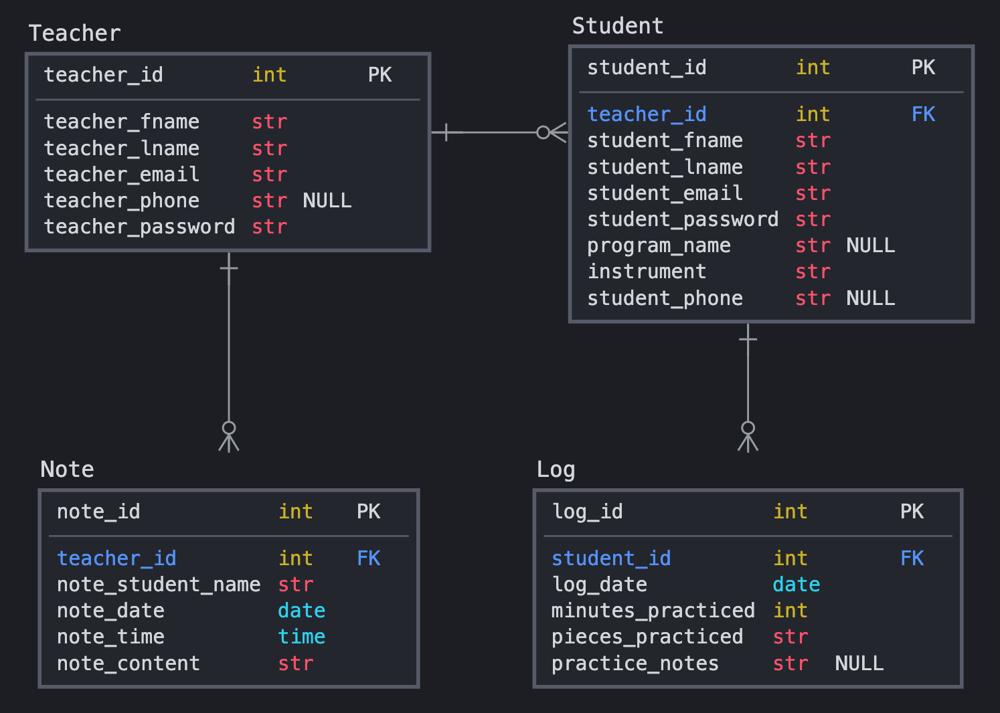
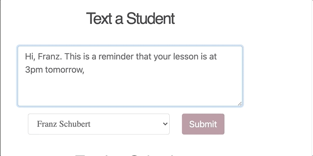
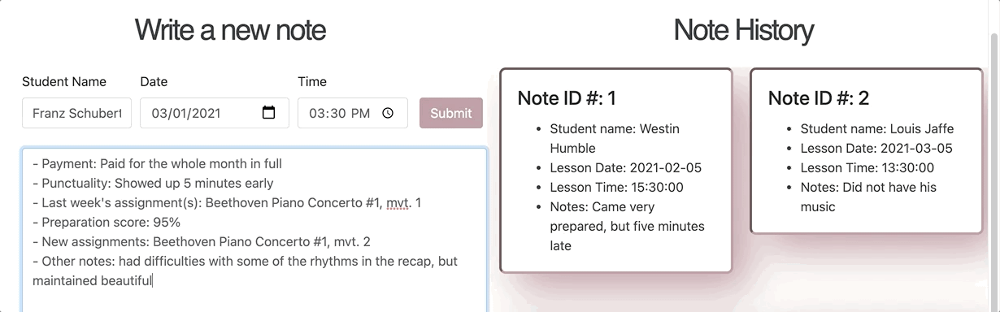

# **Virtual Music Studio**
### Created by Ilana Rose Mercer

*Virtual Music Studio* is an organizational web app for private music teachers that allows them to keep track of all their students in one space. Features include data visualization of a student’s practicing statistics, the ability for teachers to send texts to their students from the app, and recording lesson notes and practice logs.  :notes: :musical_note: :notes:

[*Demo Video*](https://www.youtube.com/watch?v=l1CXHxR0d8k)


## **Stack**
**Front-end**: JavaScript (AJAX, JSON), CSS, HTML </br>
**Back-end**: Python, Flask, Jinja, SQLAlchemy, PostgreSQL </br>
**Libraries/APIs**: Chart.js, Moment.js, Twilio SMS API

## **Data Model**



## **Features**


* Using *Charts.js*, students can log their practice sessions to create three different charts that break down their practice data in terms of frequency and length of session. This helps students and teachers to track practice habits and achieve their practicing goals. The *Moment.js* library provides the ability to parse datetime objects into displayable data.


* The *Twilio SMS API* lets teachers quickly send important updates and reminders, such as lesson time changes and practice goal nudges, straight to a student's phone without sharing their own personal contact information.



* An additional feature essential for all private lessons teachers is a lesson note taking-service, which gives teachers the ability to keep track of essential information such as payments, tardiness, assignments, etc.



## **Setup/Installation**

#### **Requirements**
* PostgreSQL
* Python 3.7.3

#### **Clone this repository**
```bash
git clone https://github.com/violatido/Virtual_Music_Studio.git
```
#### **Create a virtual environment**
``` bash
python3 -m venv env
```
#### **Activate the virtual environment**
``` bash
source env/bin/activate
```
#### **Install the requirements**
```bash
pip install -r requirements.txt
```
#### **Create database VMS**
```bash
(env) $ createdb VMS
```

#### **Create database tables**

``` bash
(env) $ python3 -i model.py
>>> db.create_all()
```

#### **Start backend server**
``` bash
(env) $ python3 server.py
```


## **Usage**

### **If using the Twilio SMS API feature:**
1. After installation, visit the [Twilio SMS API docs](https://www.twilio.com/docs/sms/api) to set up your account
2. Create a file called secrets.sh
3. In secrets.sh, set export variables for your Account SID, Auth Token, and Twilio phone number. These items will be needed in the "send_message" function declared in line 365 of [server.py](https://github.com/violatido/Virtual_Music_Studio/blob/69b6be5885f11f3f7f6e6eec5cda15a789e6785e/server.py#L365)
```bash
export ACCOUNT_SID = ''
export AUTH_TOKEN = ''
export TWILIO_PHONE = ''
```
4. Run in the terminal: source secrets.sh


## **Future Features**
* Google Calendar API to allow students and teachers to including their calendars in their profiles for quick lesson scheduling
* A weekly text to students updating them on their current weekly practice stats
* A one-on-one messaging service between students and teachers to limit the majority of the communication outside of lessons to be in-app, freeing up precious space in the teacher's email inbox
* A lesson payment tracking feature to assist teachers who have students with varying payment schedules, as well as late or missed payments


## **Acknowledgments**

I would like to thank the all of the teachers, TAs, and fellow classmates at Hackbright Academy who supported me during the creation and first implementation of Virtual Music Studio. I also wish to voice appreciation for my wonderful mentor, Kathy Kaminski, who spent time sharing wisdom and debugging knowledge with me through the journey of creating my first ever solo project.

## **About the developer ...**
Ilana Rose Mercer is a software engineer finishing her fellowship at Hackbright Academy. Before she learned how to code and became passionate about growing my career in tech, Ilana worked as a professional classical musician and private music teacher. This project is very personal to her because it is a beautiful joining of her past and present careers, and a product that she would have used daily during her private music teaching years.

Feel free to connect with Ilana here on Github and on [LinkedIn](https://www.linkedin.com/in/i-mercer/)


